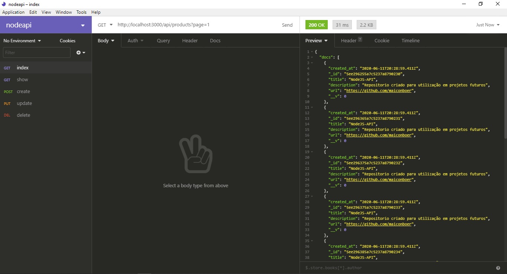
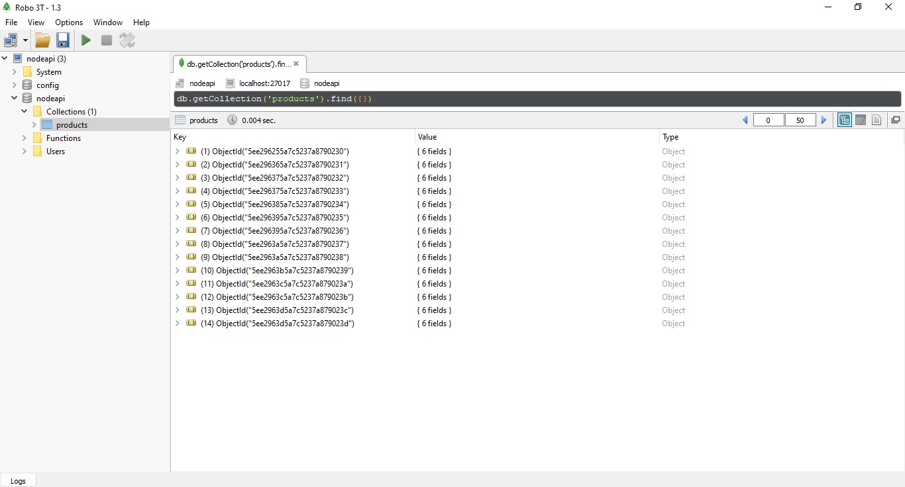

# nodejs-api
API com NODE.js,  para utilização em futuros projetos.

### Banco de dados:  
    MongoDB
    Criar banco com nome -> nodeapi
  ------------------------------  
    
    Node.js - para comunicação com banco
    Package express
    Package mongoose
    Package mongoose-paginate
    Package cors
    Package require-dir
    Software ROBO3T - possibilita visualização de tabelas e conteudos do banco de forma amigável
   
---------------------------------

### Rotas:

    GET: index -> http://localhost:3000/api/products?page=1
    GET: show -> http://localhost:3000/api/products/(id-desejado)
    POST: create -> http://localhost:3000/api/products
    PUT: update -> http://localhost:3000/api/products/(id-desejado)
    DEL: delete -> http://localhost:3000/api/products/(id-desejado)
    
---------------------------------

